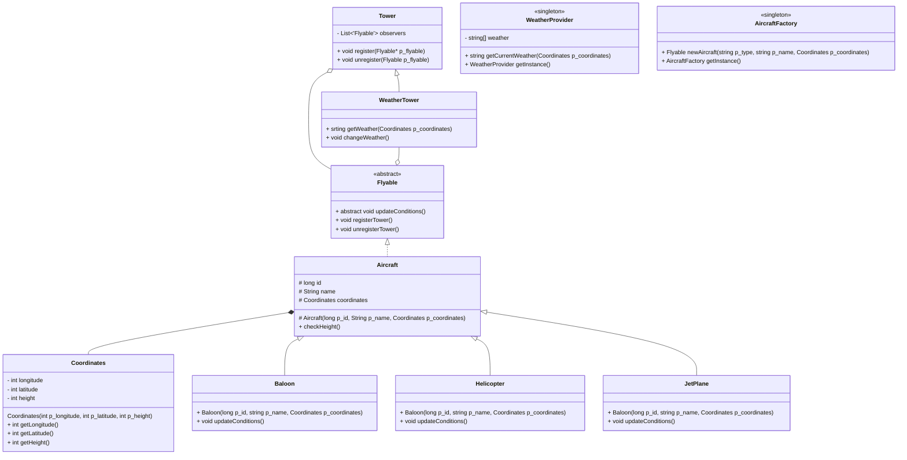

# 42 Avaj Launcher

**Status:** 🚧 In Development

A Java aircraft weather simulation program implementing core OOP design patterns (Observer, Singleton, Factory).

## About

This project simulates aircraft behavior under changing weather conditions. Aircraft register with a weather tower and respond differently to weather changes based on their type (Helicopter, JetPlane, Balloon).

## What It Does

- Reads aircraft specifications from a scenario file
- Simulates weather changes based on 3D coordinates
- Each aircraft type reacts differently to weather (SUN, RAIN, FOG, SNOW)
- Aircraft land when reaching height 0
- Outputs simulation log to `simulation.txt`

## Requirements

- Java 17 LTS
- No external libraries or build tools

## Design Patterns

- **Observer:** Tower/WeatherTower notifies registered aircraft of weather changes
- **Singleton:** WeatherProvider and AircraftFactory single instances
- **Factory:** AircraftFactory creates aircraft based on type string
