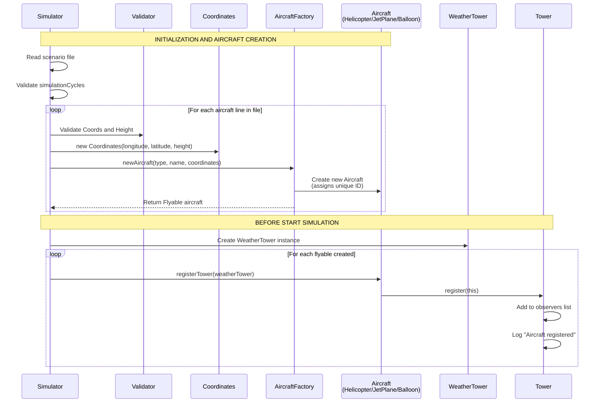
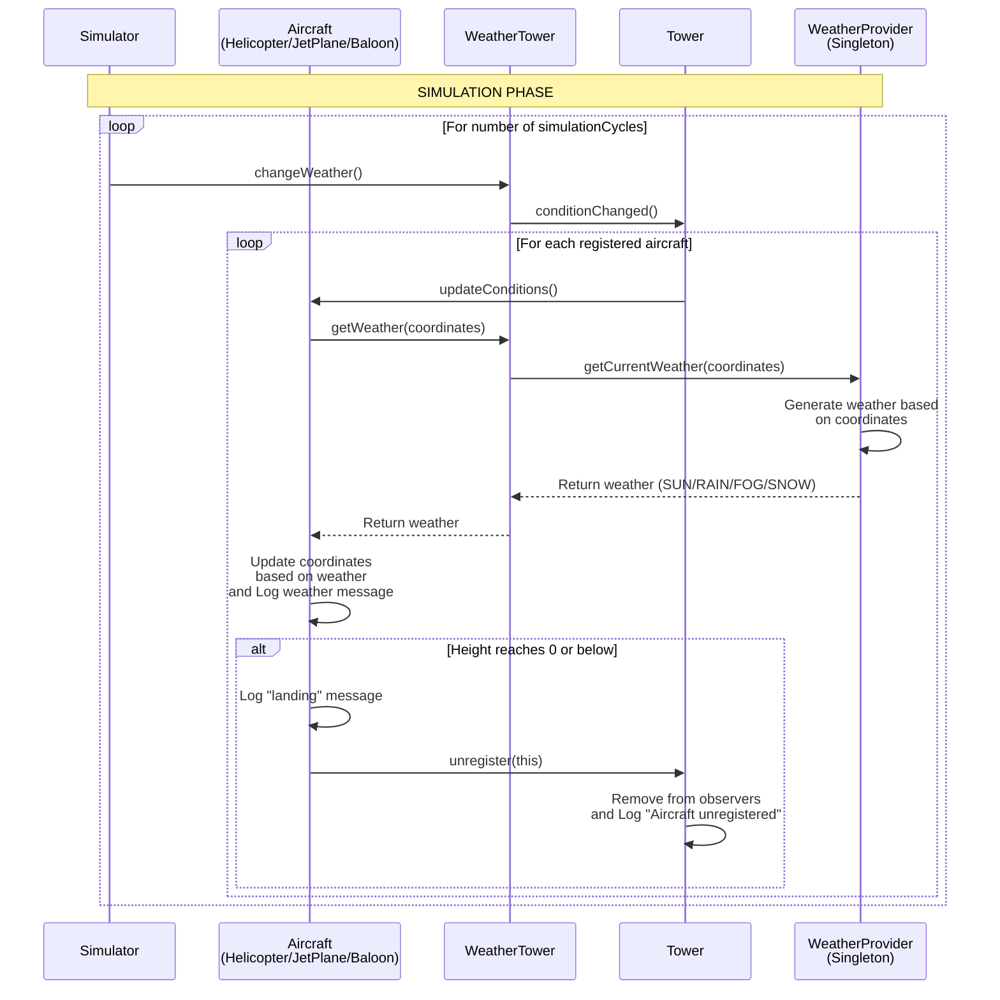
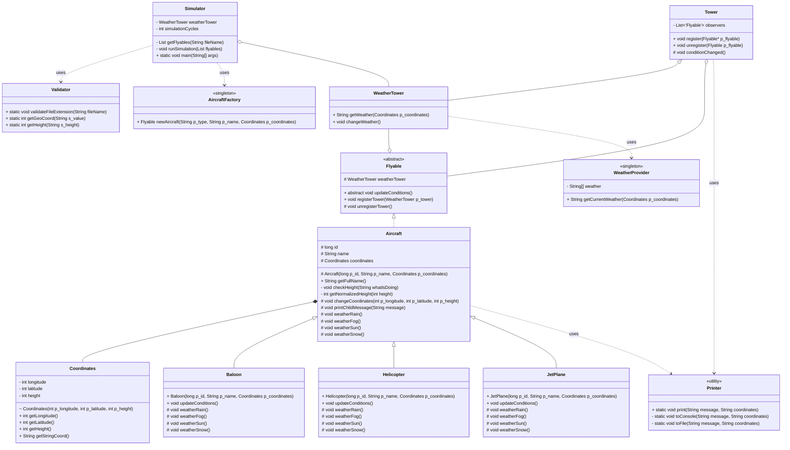

# 42 Avaj Launcher

A Java aircraft weather simulation program implementing core OOP design patterns (Observer, Singleton, Factory).


## About

This project simulates aircraft behavior under changing weather conditions. Aircraft register with a weather tower and respond differently to weather changes based on their type (Helicopter, JetPlane, Balloon).

## What It Does

- Reads aircraft specifications from a scenario file
- Simulates weather changes based on 3D coordinates
- Each aircraft type reacts differently to weather (SUN, RAIN, FOG, SNOW)
- Aircraft land when reaching height 0
- Outputs simulation log to `simulation.txt`

## Objectives

As a 42 Project, the learning purposes and objectives of this project are:
- Enter in the Java path, after C/C++
- Introduce to the concept of UML class diagrams
- Object Oriented Design Patterns: Observer, Singleton and Factory

## Usage Instructions

Compile and run with scenario.txt

```bash
make && make run
```

## Scenario File Format

The scenario file defines the simulation parameters and initial aircraft fleet.

### File Structure
```
<number_of_weather_changes>
<TYPE> <NAME> <LONGITUDE> <LATITUDE> <HEIGHT>
<TYPE> <NAME> <LONGITUDE> <LATITUDE> <HEIGHT>
...
```

### Example
```
6
Baloon B1 25 4 10
JetPlane J1 23 44 13
Helicopter H1 654 33 12
```

### Format Rules
- **Line 1**: Positive integer representing number of weather simulation cycles
- **Remaining lines**: Aircraft definitions with 5 space-separated values:
  - `TYPE`: Aircraft type (`Baloon`, `JetPlane`, or `Helicopter`)
  - `NAME`: Unique identifier for the aircraft
  - `LONGITUDE`: Positive integer for longitude coordinate
  - `LATITUDE`: Positive integer for latitude coordinate  
  - `HEIGHT`: Integer in range **0-100**

### Validation
The program validates:
- ✅ File must have `.txt` extension
- ✅ First line must be a positive integer
- ✅ Height must be between 0 and 100 (inclusive)
- ✅ Coordinates (longitude/latitude) must be positive
- ✅ Aircraft type must be valid (`Baloon`, `JetPlane`, `Helicopter`)
Invalid input will cause the program to exit with an error message.

Note: Due to the inconsistency in the 42 subject, the word "Baloon" is intentionally misspelled.

## Aircraft Weather Behaviour

| Aircraft | SUN | RAIN | FOG | SNOW |
|----------|-----|------|-----|------|
| **JetPlane** | Lat +10, H +2 | Lat +5 | Lat +1 | H -7 |
| **Helicopter** | Lon +10, H +2 | Lon +5 | Lon +1 | H -12 |
| **Balloon** | Lon +2, H +4 | H -5 | H -3 | H -15 |

*Lon = Longitude, Lat = Latitude, H = Height*

### Important Notes
- If height would exceed 100, it caps at 100
- If height reaches 0 or below, aircraft lands and unregisters from tower
- Weather is generated based on 3D coordinates (longitude, latitude, height)

## Example Output

```bash
make run
java pt.isilvat.avaj.aircraft.Simulator scenario.txt
cat simulation.txt
Tower says: Baloon#B1(1) registered to weather tower                       
Tower says: JetPlane#J1(2) registered to weather tower                     
Tower says: Helicopter#H1(3) registered to weather tower                   
Baloon#B1(1) SUN ☀️  Let's enjoy this beautifull day!                      LON: 27, LAT: 4, H: 14
JetPlane#J1(2) FOG 🌫️  Where are we going?                                LON: 23, LAT: 45, H: 13
Helicopter#H1(3) SNOW ❄️  Maintain the power, we can't cool down!          LON: 654, LAT: 33, H: 0
Helicopter#H1(3) landing.                                                  LON: 654, LAT: 33, H: 0
Tower says: Helicopter#H1(3) unregistered from weather tower               
Baloon#B1(1) SUN ☀️  Let's enjoy this beautifull day!                      LON: 29, LAT: 4, H: 18
JetPlane#J1(2) RAIN ☔  Fine, we need some washing!                         LON: 23, LAT: 50, H: 13
Baloon#B1(1) SUN ☀️  Let's enjoy this beautifull day!                      LON: 31, LAT: 4, H: 22
JetPlane#J1(2) SNOW ❄️  Keep the power man, we need warm engines!          LON: 23, LAT: 50, H: 6
Baloon#B1(1) SUN ☀️  Let's enjoy this beautifull day!                      LON: 33, LAT: 4, H: 26
JetPlane#J1(2) RAIN ☔  Fine, we need some washing!                         LON: 23, LAT: 55, H: 6
Baloon#B1(1) SUN ☀️  Let's enjoy this beautifull day!                      LON: 35, LAT: 4, H: 30
JetPlane#J1(2) SNOW ❄️  Keep the power man, we need warm engines!          LON: 23, LAT: 55, H: 0
JetPlane#J1(2) landing.                                                    LON: 23, LAT: 55, H: 0
Tower says: JetPlane#J1(2) unregistered from weather tower                 
Baloon#B1(1) SUN ☀️  Let's enjoy this beautifull day!                      LON: 37, LAT: 4, H: 34
```

## Testing
Test scenarios are in `src/tests/`:
- Edge cases (height limits, invalid input)
- Aircraft behavior verification
- Landing scenarios

Run tests:
```bash
make test
```

## Initialization Phase


```mermaid
sequenceDiagram
    participant S as Simulator
    participant V as Validator
    participant C as Coordinates
    participant AF as AircraftFactory
    participant A as Aircraft<br/>(Helicopter/JetPlane/Balloon)
    participant WT as WeatherTower
    participant T as Tower


    Note over S,A: INITIALIZATION AND AIRCRAFT CREATION
    S->>S: Read scenario file
    S->>S: Validate simulationCycles
    loop For each aircraft line in file
        S->>V: Validate Coords and Height
        S->>C: new Coordinates(longitude, latitude, height)
        S->>AF: newAircraft(type, name, coordinates)
        AF->>A: Create new Aircraft<br/>(assigns unique ID)
        AF-->>S: Return Flyable aircraft

    end

    Note over S,T: BEFORE START SIMULATION
    S->>WT: Create WeatherTower instance
    loop For each flyable created
        S->>A: registerTower(weatherTower)
        A->>T: register(this)
        T->>T: Add to observers list
        T->>T: Log "Aircraft registered"
    end
```

## Simulation Phase


```mermaid
sequenceDiagram
    participant S as Simulator
    participant A as Aircraft<br/>(Helicopter/JetPlane/Baloon)
    participant WT as WeatherTower
    participant T as Tower
    participant WP as WeatherProvider<br/>(Singleton)


    Note over S,WP: SIMULATION PHASE
    loop For number of simulationCycles
        S->>WT: changeWeather()
        WT->>T: conditionChanged()
        
        loop For each registered aircraft
            T->>A: updateConditions()
            A->>WT: getWeather(coordinates)
            WT->>WP: getCurrentWeather(coordinates)
            WP->>WP: Generate weather based<br/>on coordinates
            WP-->>WT: Return weather (SUN/RAIN/FOG/SNOW)
            WT-->>A: Return weather
            
            A->>A: Update coordinates<br/>based on weather <br/> and Log weather message
            
            alt Height reaches 0 or below
                A->>A: Log "landing" message
                A->>T: unregister(this)
                T->>T: Remove from observers <br/> and Log "Aircraft unregistered"
            end
        end
    end
```

## UML Class diagram


```mermaid

classDiagram

    class Tower {    
        - List<'Flyable'> observers
        + void register(Flyable* p_flyable)
        + void unregister(Flyable p_flyable)
        # void conditionChanged()
    }

    class Flyable {
        <<abstract>>
        # WeatherTower weatherTower
        + abstract void updateConditions()
        + void registerTower(WeatherTower p_tower)

        # void unregisterTower()
    }

    
    class Aircraft {
        # long id
        # String name
        # Coordinates coordinates
        # Aircraft(long p_id, String p_name, Coordinates p_coordinates)
        + String getFullName()

        - void checkHeight(String whatIsDoing)
        - int getNormalizedHeight(int height)

        # void changeCoordinates(int p_longitude, int p_latitude, int p_height)
        # void printChildMessage(String message)

        # void weatherRain()
        # void weatherFog()
        # void weatherSun()
        # void weatherSnow()
    }

    class Coordinates {
        - int longitude
        - int latitude
        - int height
        ~ Coordinates(int p_longitude, int p_latitude, int p_height)
        + int getLongitude()
        + int getLatitude()
        + int getHeight()

        + String getStringCoord()
    }

    class WeatherProvider {
        <<singleton>>
        - String[] weather
        + String getCurrentWeather(Coordinates p_coordinates)
    }

    class WeatherTower {
        + String getWeather(Coordinates p_coordinates)
        + void changeWeather()
    }

    class Baloon {
        + Baloon(long p_id, String p_name, Coordinates p_coordinates)
        + void updateConditions()

        # void weatherRain()
        # void weatherFog()
        # void weatherSun()
        # void weatherSnow()    
    }
    class Helicopter {
        + Helicopter(long p_id, String p_name, Coordinates p_coordinates)
        + void updateConditions()

        # void weatherRain()
        # void weatherFog()
        # void weatherSun()
        # void weatherSnow()    
    }
    class JetPlane {
        + JetPlane(long p_id, String p_name, Coordinates p_coordinates)
        + void updateConditions()

        # void weatherRain()
        # void weatherFog()
        # void weatherSun()
        # void weatherSnow()    
    }

    class AircraftFactory {
        <<singleton>>
        + Flyable newAircraft(String p_type, String p_name, Coordinates p_coordinates)
    }

    class Printer {
        <<utility>>
        + static void print(String message, String coordinates)
        - static void toConsole(String message, String coordinates)
        - static void toFile(String message, String coordinates)
    }
    
    class Validator {
        + static void validateFileExtension(String fileName)
        + static int getGeoCoord(String s_value)
        + static int getHeight(String s_height)
    }

    class Simulator {
        - WeatherTower weatherTower
        - int simulationCycles
        - List<Flyable> getFlyables(String fileName)
        - void runSimulation(List<Flyable> flyables)
        + static void main(String[] args)
    }

    Flyable <|.. Aircraft
    Tower <|-- WeatherTower
    Tower o-- Flyable
    WeatherTower --o Flyable
    Aircraft *-- Coordinates

    Aircraft <|-- Baloon 
    Aircraft <|-- Helicopter 
    Aircraft <|-- JetPlane

    Tower ..> Printer : uses
    Aircraft ..> Printer : uses
    Simulator ..> Validator : uses
    Simulator ..> AircraftFactory : uses
    WeatherTower ..> WeatherProvider : uses

    Simulator o-- WeatherTower
    
```

## Project Structure

```
42.avaj-launcher/
├── README.md
├── scenario.txt
├── doc/
│   ├── avaj.jpg
│   ├── *.mermaid          # UML diagrams
│   └── private/*           # Encrypted files
└── src/
    ├── Makefile
    ├── scenario.txt
    └── pt/isilvat/avaj/
        ├── aircraft/
        │   ├── Simulator.java      # Main entry point
        │   ├── Aircraft.java
        │   ├── Flyable.java        # Abstract
        │   ├── Coordinates.java
        │   ├── Helicopter.java
        │   ├── JetPlane.java
        │   └── Baloon.java
        ├── weather/
        │   ├── Tower.java
        │   ├── WeatherTower.java
        │   └── WeatherProvider.java # Singleton
        ├── factory/
        │   └── AircraftFactory.java # Singleton
        ├── tools/
        │   ├── Validator.java
        │   └── Printer.java
        └── exceptions/
            ├── *.java
```

## Requirements

- Java 17 LTS
- No external libraries or build tools

## Design Patterns

- **Observer:** Tower/WeatherTower notifies registered aircraft of weather changes
- **Singleton:** WeatherProvider and AircraftFactory single instances
- **Factory:** AircraftFactory creates aircraft based on type string
